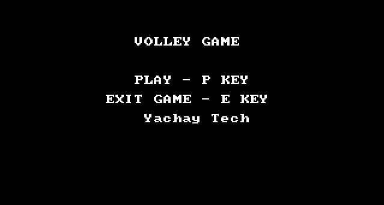
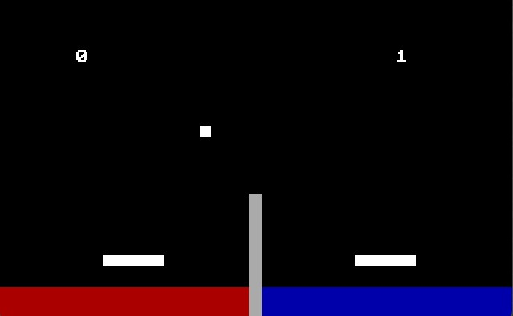

# 🏐 VOLLEY GAME — 8086 Assembly Edition

**Un juego de voleibol arcade para dos jugadores, escrito completamente en lenguaje ensamblador para el Intel 8086.**  
Proyecto académico desarrollado para la materia **Arquitectura del Computador** en la universidad **Yachay Tech**, explorando conceptos de gráficos, entrada por teclado y física básica en modo real x86.

---

## 🎮 Descripción

**VOLLEY GAME** es un juego retro estilo arcade donde dos jugadores compiten en una cancha de voleibol simplificada.  
El objetivo es simple: **alcanzar 5 puntos antes que tu oponente**, golpeando la pelota con una paleta controlada por teclado.

---
## 📸 Vista previa





---
## ✨ Características

- 🎨 **Gráficos** en modo 13h (320×200, 256 colores).
- ⚙️ **Física básica** con gravedad, rebotes y colisiones.
- 🎯 **Controles independientes** para cada jugador:
  - **Jugador 1:** `A` / `D` para moverse.
  - **Jugador 2:** `J` / `L` para moverse.
- 📜 **Pantallas**: menú principal y pantalla de Game Over.
- 🏆 **Sistema de puntuación** y detección automática de ganador.
- 💻 **Código 100% en ensamblador 8086**, sin bibliotecas externas.

---

## 🧪 Requisitos

| Herramienta | Recomendación |
|-------------|--------------|
| Emulador DOS | [DOSBox](https://www.dosbox.com/) |
| Ensamblador | MASM 5.x o superior |
| Linker | LINK (compatible con MASM) |
| Sistema operativo | Windows, Linux o macOS (vía DOSBox) |

---

## ▶️ Cómo ejecutar

1. **Prepara la carpeta de trabajo**, por ejemplo:
   **Abre DOSBox** y monta la carpeta
```dos
MOUNT C C:\Users\Freddy\Desktop\game
C:
MASM VOLLEY.ASM;
LINK VOLLEY;
VOLLEY
```

## 🕹️ Controles del Juego

| Tecla        | Jugador / Función                  | Descripción |
|--------------|------------------------------------|-------------|
| `P` / `p`    | Ambos                              | Inicia la partida desde el menú principal |
| `E` / `e`    | Ambos                              | Sale del juego |
| `A` / `D`    | Jugador 1                          | Mueve la paleta izquierda hacia izquierda/derecha |
| `J` / `L`    | Jugador 2                          | Mueve la paleta derecha hacia izquierda/derecha |
| `R` / `r`    | Ambos                              | Reinicia la partida tras Game Over |

---

## 🧱 Estructura del Código

| Procedimiento / Módulo           | Responsabilidad |
|----------------------------------|-----------------|
| `MAIN`                           | Controla el bucle principal y la máquina de estados (Menú ↔ Juego ↔ Game Over) |
| `MOVE_PELOTA`                    | Gestiona la física de la pelota, colisiones, gravedad y detección de puntos |
| `MOVE_PADDLES`                   | Lee la entrada del teclado y limita el movimiento de las paletas |
| `DRAW_*`                         | Renderiza elementos en pantalla: pelota, paletas, piso, red y UI |
| `RESET_PELOTA_POSITION`          | Centra y reposiciona la pelota tras cada punto |
| `DRAW_GAME_OVER_MENU` / `DRAW_MAIN_MENU` | Muestran las interfaces gráficas de Game Over y Menú principal |


───────────────────────────────────────
───▐▀▄───────▄▀▌───▄▄▄▄▄▄▄─────────────
───▌▒▒▀▄▄▄▄▄▀▒▒▐▄▀▀▒██▒██▒▀▀▄──────────
──▐▒▒▒▒▀▒▀▒▀▒▒▒▒▒▒▒▒▒▒▒▒▒▒▒▒▒▀▄────────
──▌▒▒▒▒▒▒▒▒▒▒▒▒▒▒▒▄▒▒▒▒▒▒▒▒▒▒▒▒▀▄──────
▀█▒▒▒█▌▒▒█▒▒▐█▒▒▒▀▒▒▒▒▒▒▒▒▒▒▒▒▒▒▒▌─────
▀▌▒▒▒▒▒▒▀▒▀▒▒▒▒▒▒▀▀▒▒▒▒▒▒▒▒▒▒▒▒▒▒▐───▄▄
▐▒▒▒▒▒▒▒▒▒▒▒▒▒▒▒▒▒▒▒▒▒▒▒▒▒▒▒▒▒▒▒▒▒▌▄█▒█
▐▒▒▒▒▒▒▒▒▒▒▒▒▒▒▒▒▒▒▒▒▒▒▒▒▒▒▒▒▒▒▒▒▒█▒█▀─
▐▒▒▒▒▒▒▒▒▒▒▒▒▒▒▒▒▒▒▒▒▒▒▒▒▒▒▒▒▒▒▒▒▒█▀───
▐▒▒▒▒▒▒▒▒▒▒▒▒▒▒▒▒▒▒▒▒▒▒▒▒▒▒▒▒▒▒▒▒▒▌────
─▌▒▒▒▒▒▒▒▒▒▒▒▒▒▒▒▒▒▒▒▒▒▒▒▒▒▒▒▒▒▒▒▐─────
─▐▒▒▒▒▒▒▒▒▒▒▒▒▒▒▒▒▒▒▒▒▒▒▒▒▒▒▒▒▒▒▒▌─────
──▌▒▒▒▒▒▒▒▒▒▒▒▒▒▒▒▒▒▒▒▒▒▒▒▒▒▒▒▒▒▐──────
──▐▄▒▒▒▒▒▒▒▒▒▒▒▒▒▒▒▒▒▒▒▒▒▒▒▒▒▒▒▄▌──────
────▀▄▄▀▀▀▀▀▄▄▀▀▀▀▀▀▀▄▄▀▀▀▀▀▄▄▀────────


## Créditos
Este proyecto fue desarrollado por Tu "[Freddy Valenzuela](https://github.com/Freddyrex)"

